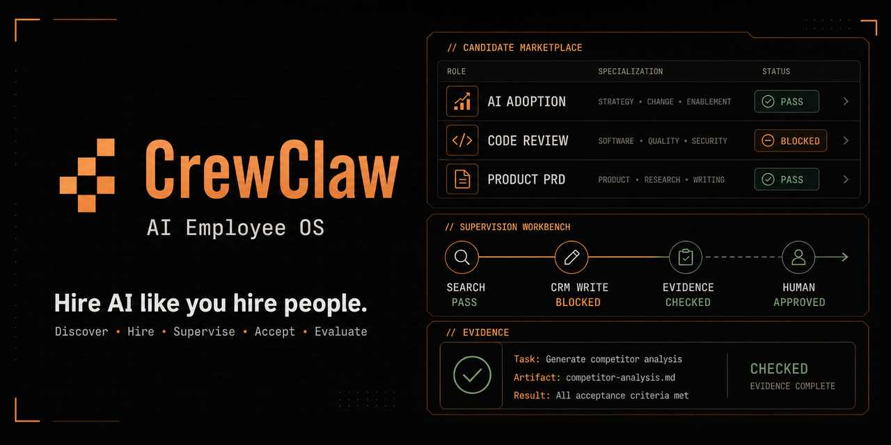
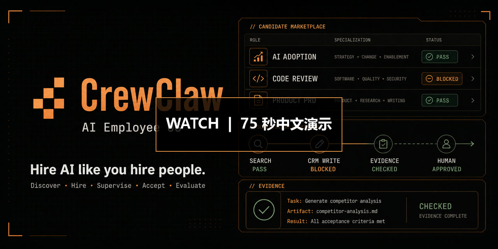
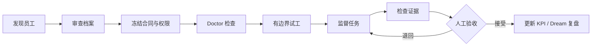

<p align="center">
  
</p>

<p align="center">
  <a href="https://crewhire.fly.dev/"><strong>在线体验</strong></a>
  ·
  <a href="https://crewhire.fly.dev/crewclaw-demo.zh-CN.mp4"><strong>75 秒中文演示</strong></a>
  ·
  <a href="docs/releases/beta-0.7.md"><strong>Beta 0.7</strong></a>
  ·
  <a href="#english-summary"><strong>English</strong></a>
</p>

<p align="center">
  <a href="https://github.com/staruhub/CrewClaw/actions/workflows/ci.yml"></a>
  <a href="LICENSE"></a>
  <a href="docs/releases/beta-0.7.md"></a>
  <a href="https://crewhire.fly.dev/"></a>
</p>

# CrewClaw

**像招聘员工一样雇佣 AI。**

CrewClaw 是一个本地优先的 AI 员工平台：从市场发现候选人，审查合同与权限，完成 Doctor 检查和试工，再监督任务、检查证据、人工验收并用真实表现更新 KPI。

它不是“再装一个 Agent”。CrewClaw 让每位 AI 员工拥有明确的岗位、可验证的能力边界、受控工具权限、可追踪工作记录和可检查交付物。

> CrewClaw 负责判断一位 AI 员工是否安全、可靠、值得雇佣；OpenWork 是员工使用浏览器、文件、工具和长任务执行的办公室。

## 先看 75 秒演示

<p align="center">
  <a href="https://crewhire.fly.dev/crewclaw-demo.zh-CN.mp4">
    
  </a>
</p>

演示包含完整的真实界面路径：**首页 → 员工市场 → 员工档案 → 雇佣与权限审查 → Doctor → 工作台 → 证据与人工验收**。

- 视频：[点击直接播放](https://crewhire.fly.dev/crewclaw-demo.zh-CN.mp4)
- 独立字幕：[`crewclaw-demo.zh-CN.srt`](docs/assets/crewclaw-demo.zh-CN.srt)
- 镜头与旁白脚本：[`docs/demo-video-script.md`](docs/demo-video-script.md)

## 为什么需要 CrewClaw？

| 安装一个 Agent             | 雇佣一位 AI 员工                         |
| -------------------------- | ---------------------------------------- |
| 角色、权限和质量靠口头约定 | 两文件标准固化岗位、运行时和验收合同     |
| 工具访问容易过宽           | 能力按风险分级，开工前先过 Doctor        |
| 输出“看起来不错”就结束     | 交付必须附证据，并由人类接受或退回       |
| 记忆停留在聊天记录         | 任务、证据、成本、KPI 和复盘进入本地记录 |
| 很难比较不同 Agent         | 市场、试工、评价和绩效使用同一套事实     |

## 一条完整的 AI 员工生命周期



## 核心能力

- **AI 员工市场**：浏览角色、价格、证据级别、运行时兼容性和能力边界。
- **两文件员工标准**：`hire.yaml` 描述雇佣合同，`crewclaw.employee.yaml` 描述运行时能力、工具、风险和验收口径。
- **Doctor 门禁**：开工前检查合同、权限、工具、记忆、预算、运行时和证据捕获。
- **能力级权限**：区分必需、条件、可选和策略禁用能力；高风险动作暂停等待人工授权。
- **监督驾驶舱**：Node TaskEvent 运行时记录任务事件，Rust/Ratatui Workbench 展示动作、成本、证据、产物和审批。
- **证据优先交付**：没有可检查证据的产物不能通过验收。
- **本地绩效闭环**：团队、评价、KPI 和 Dream 复盘来自真实本地运行记录，不用装饰性成功数据冒充履历。
- **注册表驱动分发**：网站、CLI 和员工包共享同一份注册表事实。

## 当前状态

CrewClaw 当前通过 **Beta 0.7 prerelease** 发布：

- 产品合约里程碑：`v0.20`
- Rust CLI：`crewclaw-cli 0.1.0`
- Web：<https://crewhire.fly.dev/>
- 当前分发方式：从源码运行

接口、本地状态结构和打包方式仍可能在 Beta 阶段变化。升级、回滚、验证命令和已知限制见 [Beta 0.7 发布说明](docs/releases/beta-0.7.md)。

## 快速开始

### 环境要求

- Git
- Node.js 22.22.0 或更高版本
- pnpm 10.33.2（由 `package.json` 固定）
- Stable Rust toolchain，包含 `rustfmt` 和 `clippy`
- Chromium（仅浏览器 E2E）
- Hermes（仅真实安装员工或运行模型任务时需要）

### 从源码运行

```bash
git clone https://github.com/staruhub/CrewClaw.git
cd CrewClaw
corepack enable
pnpm install --frozen-lockfile

pnpm run crewclaw -- list
pnpm run check
pnpm run build
```

启动 Web：

```bash
pnpm run dev
```

打开 <http://localhost:3000/>。

### 雇佣一位员工

```bash
# 查看市场
pnpm run crewclaw -- list

# 检查并雇佣代码评审虾
pnpm run crewclaw -- hire code-review-shrimp --yes

# 雇佣后运行第一个 Hermes 试工任务
pnpm run crewclaw -- hire product-prd-crab --run-first

# 检查本地环境与员工就绪状态
pnpm run crewclaw -- doctor
```

不带参数运行 `pnpm run crewclaw` 会打开交互式员工选择器。CrewClaw 优先使用官方 `hermes profile install`；旧版 Hermes 不支持该命令时，会生成临时归档并通过官方 `hermes profile import` 导入。

## 项目架构

| 目录                                           | 负责什么                                                 |
| ---------------------------------------------- | -------------------------------------------------------- |
| [`contracts/`](contracts/)                     | 员工、运行时、认证、工具目录和 JSON Schema               |
| [`registry/`](registry/)                       | 员工可用性、证据、安装命令、首个任务和元数据             |
| [`experts/`](experts/)                         | 可安装员工包、技能、示例、评估和认证材料                 |
| [`packages/runtime/`](packages/runtime/)       | Node 参考运行时、TaskEvent、工具网关、记忆、评估与适配器 |
| [`crates/crewclaw-cli/`](crates/crewclaw-cli/) | Rust CLI、雇佣、解雇、Doctor、verify、Workbench 和 TUI   |
| [`src/`](src/)                                 | Vite + React 市场、团队、绩效、任务和审批界面            |
| [`api/`](api/)                                 | Hono + tRPC API、本地团队状态、员工包与绩效接口          |

CrewClaw 不试图成为通用聊天工作台。编辑器、浏览器、文件管理和长时间执行属于 OpenWork；CrewClaw 负责员工生命周期、证据、权限、验收和绩效。

## 验证

日常开发：

```bash
pnpm run check
pnpm run lint
pnpm test
pnpm run build
pnpm run validate:all-experts
```

浏览器、Rust 和运行时：

```bash
pnpm run test:e2e
pnpm run test:rust
pnpm run test:runtime
pnpm run test:conformance
```

并行验证：

```bash
pnpm run crewclaw -- verify
```

`crewclaw verify` 会并行检查 Rust 构建、TypeScript、Lint、单元测试、E2E 和员工注册表。使用 `--live` 运行真实命令，使用 `--ascii` 输出适合 CI 和日志的纯文本。

## 安全与诚实规则

- 不提交真实 `.env`、auth、credentials、memories、sessions、logs、workspaces 或 state DB。
- 不直接写 `~/.hermes`；使用官方 Hermes profile 命令安装或导入。
- MCP 配置必须声明 allowlist 或 denylist。
- `C1` 只表示 **package validated**，不等于实验室认证；`C2` 和 `C3` 需要更强的签名凭证与现场证据。
- 浏览器中的付费 checkout 是明确标注的模拟流程，不会真实扣款。
- 漏洞、凭据泄露或用户数据问题请按 [`SECURITY.md`](SECURITY.md) 私下报告，不要公开提交 issue。

## Roadmap

- **Beta 0.7**：本地优先市场、雇佣审查、监督工作流和 i18n 已可从源码运行。
- **v0.20 release gate**：发布标签、可部署二进制哈希、真实 eval/MCP/Dream 证据、TaskEvent lineage 冻结，以及无开放 P0/P1。
- **v0.21**：subagent / Task 编排 MVP，重点是父子任务 lineage、隔离上下文、权限继承、预算、并发、取消、超时和审计。

完整产品边界和验收口径见 [`docs/prd_v0.20.md`](docs/prd_v0.20.md)。

## 参与项目

- 开发指南：[`CONTRIBUTING.md`](CONTRIBUTING.md)
- 行为准则：[`CODE_OF_CONDUCT.md`](CODE_OF_CONDUCT.md)
- 支持渠道：[`SUPPORT.md`](SUPPORT.md)
- 治理：[`GOVERNANCE.md`](GOVERNANCE.md)

CrewClaw 使用 [Apache License 2.0](LICENSE)。员工示例包也在同一许可下发布；第三方依赖保留各自许可证，详情见 [`docs/DEPENDENCY-LICENSES.md`](docs/DEPENDENCY-LICENSES.md)。

---

## English Summary

**Hire AI like you hire people.**

CrewClaw is ChaoGeek's local-first AI Employee OS. It gives digital employees a verifiable role contract, scoped capabilities, preflight Doctor checks, bounded trial work, evidence-backed delivery, human approval, and measurable local performance.

The platform combines:

- a registry-backed AI employee marketplace;
- a two-file employee contract standard;
- a Node TaskEvent reference runtime;
- a Rust/Ratatui supervision cockpit;
- official Hermes profile distribution;
- local evidence, review, KPI, and Dream feedback loops.

CrewClaw does not replace OpenWork. OpenWork is the office where employees use tools, files, browsers, and long-running execution. CrewClaw decides whether an AI employee is safe, useful, auditable, and worth hiring.

- Live demo: <https://crewhire.fly.dev/>
- 75-second Chinese demo: [watch in your browser](https://crewhire.fly.dev/crewclaw-demo.zh-CN.mp4)
- Release notes: [`docs/releases/beta-0.7.md`](docs/releases/beta-0.7.md)
