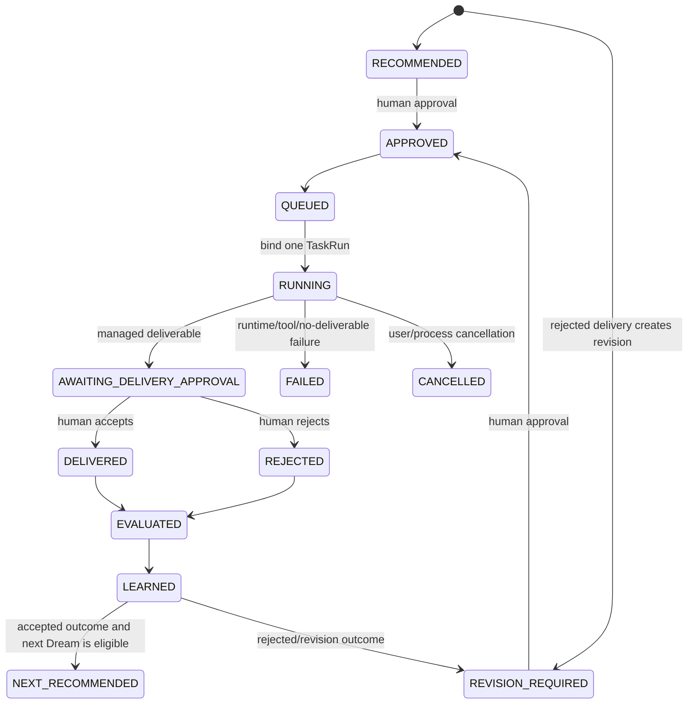

# CrewClaw product lifecycle closure

This document is the implementation matrix for the executable employee
lifecycle. It distinguishes CrewClaw's control plane from the OpenWork/runtime
execution plane and records intentionally unavailable features instead of
presenting them as successful actions.

## Website lifecycle matrix

| Lifecycle stage          | User entry                                              | Executable action and persisted contract                                                                                                                                                                                    | Return path                                                           | Final status                                |
| ------------------------ | ------------------------------------------------------- | --------------------------------------------------------------------------------------------------------------------------------------------------------------------------------------------------------------------------- | --------------------------------------------------------------------- | ------------------------------------------- |
| Landing                  | `/`                                                     | Registry-backed employee discovery links to `/marketplace`                                                                                                                                                                  | Marketplace                                                           | Executable                                  |
| Marketplace              | `/marketplace` and `/search`                            | Every available employee card links to `/employee/:id`; unavailable records retain their registry reason                                                                                                                    | Employee profile                                                      | Executable                                  |
| Employee profile         | `/employee/:id`                                         | Displays package, evidence, capability, permission, lifecycle, KPI and review truth from generated registry plus local performance                                                                                          | `/hire/:id`, package download, team/performance                       | Executable                                  |
| Contract and permissions | `/hire/:id`                                             | Required capabilities are fixed; selectable capabilities produce canonical capability grants; disabled capabilities remain visibly unavailable                                                                              | Doctor on the same page                                               | Executable                                  |
| Doctor                   | `/hire/:id`                                             | `POST /api/local/employees/:slug/doctor` runs package Doctor and onboarding Doctor against the real ToolCatalog, runtime schemas, grants and configured provider health                                                     | Bounded trial or an explicit blocking reason/fix                      | Executable and fail-closed                  |
| Trial                    | `/hire/:id`                                             | `POST /api/local/employees/:slug/trials` creates a real persisted TaskRun and invokes registered `artifact_write` behind the permission gateway; artifact, evidence and tool audit records are persisted                    | `/task-run/:taskRunId` and trial decision                             | Executable                                  |
| Trial approval           | `/hire/:id`                                             | `POST .../trials/:taskRunId/decision` persists accept/reject before KPI/reflection reconciliation; replay is idempotent                                                                                                     | Hire or rerun/fix                                                     | Executable and recoverable                  |
| Hire/install             | `/hire/:id`                                             | `POST /api/local/team/hire` accepts only an accepted trial for the same employee and exact grant set, then writes the durable local roster. Verified package and registry CLI commands remain available for another machine | Team plus a generated TUI command                                     | Executable                                  |
| Workbench task           | generated `crew run <employee> '<task>' --tui`          | Rust TUI sends user actions to the Node TaskEvent bridge; the bridge uses the existing runtime agent loop and ToolCatalog rather than a second executor                                                                     | Live TaskEvent projection                                             | Executable                                  |
| Evidence and approval    | TUI Workbench and website `/task-run/:id`               | TUI owns mutations and approval gates. The website is an honest read-only projection of persisted TaskRun, tool audit, artifact and evidence state                                                                          | Accept, reject or revision in TUI                                     | Executable; website does not fake mutations |
| Delivery and KPI         | TUI approval, `/team`, `/performance`, employee profile | Acceptance transaction persists decision, ProofPack, TaskRun terminal state, KPI and reflection; rejection persists its own terminal state and KPI                                                                          | Performance and evaluation views                                      | Executable and replay-safe                  |
| Evaluation and learning  | `/performance`, TUI EVAL/DREAM                          | Persisted evaluation, reflection, KPI and evidence are projected. Invalid or absent records remain visibly unverified                                                                                                       | Dream recommendation                                                  | Executable                                  |
| Dream and next task      | TUI DREAM                                               | A persisted growth cycle carries KPI/evaluation/evidence/history context through human approval into the same TaskRun/runtime pipeline                                                                                      | Next delivery or revision; accepted work can recommend the next cycle | Executable and recoverable                  |

The paid plans are intentionally disabled. No billing provider or entitlement
backend exists in this repository, so the website does not simulate checkout
or claim that a paid entitlement was created. The local free lifecycle is the
only executable website path.

## Dream growth state machine

The persisted contract is `crewclaw.growth-cycle/v1`.

The TaskEvent family is:

1. `dream.next_task_ready` or `dream.revision_task_created`
2. `dream.next_task_approved`
3. `dream.next_task_queued`
4. `dream.next_task_started`
5. `dream.next_task_delivery_ready`
6. `dream.next_task_settled`
7. `dream.next_task_evaluated`
8. `dream.next_task_learned`
9. `dream.next_cycle_recommended`

Each transition is written under the local state lock with an idempotency key
and plan hash. A cycle binds at most one TaskRun. Execution cannot begin from
`RECOMMENDED` or `REVISION_REQUIRED`; the human approval receipt is mandatory.
Startup recovery reads the bound TaskRun, completes any terminal settlement,
and reconciles evaluation/learning without double-counting KPI. An accepted
delivery may advance to `NEXT_RECOMMENDED`; a rejected delivery creates a new
approval-gated `dream_revision` cycle.

## Runtime/TUI tool parity

The canonical source is `contracts/tool-catalog.json`. `session.ready` sends
the employee-specific resolution to the Rust reducer. The Tools drawer shows
the capability, actual runtime tool/provider, availability and reason,
authorization, operation, risk, timeout and declared side effects. Actual
invocations additionally show arguments, permission decision and source,
timestamps, elapsed time, progress and terminal result.

| Capability                   | Execution binding                       | Risk/timeout | TUI behavior                                                                    |
| ---------------------------- | --------------------------------------- | ------------ | ------------------------------------------------------------------------------- |
| `web.search`                 | `web_search`                            | P0 / 30s     | Ready only with a healthy real search provider; otherwise blocked with reason   |
| `web.fetch`                  | `web_fetch`                             | P0 / 30s     | Registered runtime call                                                         |
| `web.fetch_extract`          | `web_fetch`                             | P0 / 30s     | Registered runtime call                                                         |
| `browser.render`             | `browser_render`                        | P2 / 45s     | Registered browser call; unavailable is explicit when browser support is absent |
| `source.verify`              | `crewclaw.evidence` provider            | P0 / 5s      | Engine-owned evidence operation; no fake model tool                             |
| `evidence.create`            | `crewclaw.evidence` provider            | P1 / 5s      | Engine-owned persisted evidence operation                                       |
| `artifact.report`            | `artifact_write`                        | P1 / 10s     | Registered managed-artifact call behind permission and delivery gates           |
| `files.read`                 | `read_file`                             | P0 / 10s     | Registered runtime call                                                         |
| `document.read`              | `read_file`                             | P0 / 10s     | Registered runtime call                                                         |
| `repo.diff.read`             | `git_diff`                              | P0 / 15s     | Registered runtime call                                                         |
| `repo.search`                | `search`; optional `mcp.github` binding | P0 / 15s     | Runtime or configured MCP resolution is shown                                   |
| `repo.status.read`           | `git_status`                            | P0 / 10s     | Registered runtime call                                                         |
| `test.run`                   | `test_run`                              | P2 / 120s    | Long-running registered call with progress/cancel/timeout lifecycle             |
| `places.search`              | configured `places` adapter             | P2 / 30s     | Disabled with provider reason until configured                                  |
| `contacts.read`              | configured `contacts` adapter           | P3 / 30s     | Disabled with provider/authorization reason until configured                    |
| `calendar.availability.read` | configured `calendar` adapter           | P3 / 30s     | Disabled with provider/authorization reason until configured                    |
| `community.context.read`     | `read_file`                             | P0 / 10s     | Registered scoped runtime call                                                  |
| `analytics.aggregate`        | `crewclaw.analytics` provider           | P2 / 10s     | Engine/provider capability; availability is registry-derived                    |
| `broadcast.draft`            | `crewclaw.artifacts` provider           | P1 / 10s     | Draft-only engine operation; never sends                                        |
| `shell.run`                  | `bash`                                  | P3 / 120s    | Explicit authorization, streamed lifecycle, cancel and timeout                  |
| `files.write`                | `write_file`/`edit_file`                | P3 / 10s     | Explicit authorization and audited side effect                                  |
| `repo.push`                  | configured `git` adapter                | P4 / 60s     | No built-in fake push; disabled until an adapter and grant exist                |
| `production.deploy`          | configured `deployment` adapter         | P4 / 300s    | No built-in fake deploy; disabled until configured                              |
| `message.send`               | configured `messaging` adapter          | P4 / 30s     | No built-in fake send; explicit authorization required                          |
| `email.send`                 | configured `email` adapter              | P4 / 30s     | No built-in fake send; explicit authorization required                          |
| `crm.write`                  | configured `crm` adapter                | P4 / 30s     | No built-in fake write; explicit authorization required                         |
| `broadcast.send`             | configured `community` adapter          | P4 / 30s     | No built-in fake send; explicit authorization required                          |
| `member_data.write`          | configured `community` adapter          | P4 / 30s     | No built-in fake write; explicit authorization required                         |

Cancellation uses the active runtime abort signal and emits
`tool.cancelled`. Timeouts remain ToolCatalog/runtime errors rather than UI
timers. A tool failure emits a terminal tool event and cannot fabricate an
artifact or evidence. The reference runtime currently has no enabled mutating
external adapter, so it cannot create an ambiguous post-dispatch side effect:
those capabilities stay unavailable with a reason. A future adapter must emit
an explicit uncertain-outcome audit result and must not silently retry a
non-idempotent action before it can be marked ready.

## Deliberate boundaries and remaining external prerequisites

- The website does not execute model tasks or approve deliveries. It creates
  the local contract/trial/hire records, hands the task to the real TUI, and
  reads the resulting records back.
- OpenWork/runtime remains responsible for browser, files, model execution,
  long-running work and MCP transport. CrewClaw owns discovery, contract,
  grants, approval, evidence, KPI, evaluation and growth state.
- Live search, browser rendering and adapter/MCP capabilities need their
  declared provider, credentials and host support. Doctor reports a blocking
  or degraded reason when those external prerequisites are absent.
- Paid billing is not implemented and is visibly disabled.
